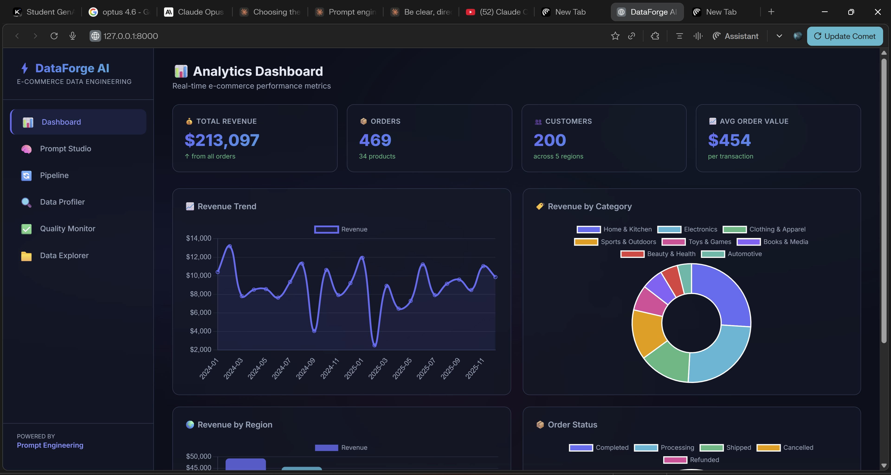
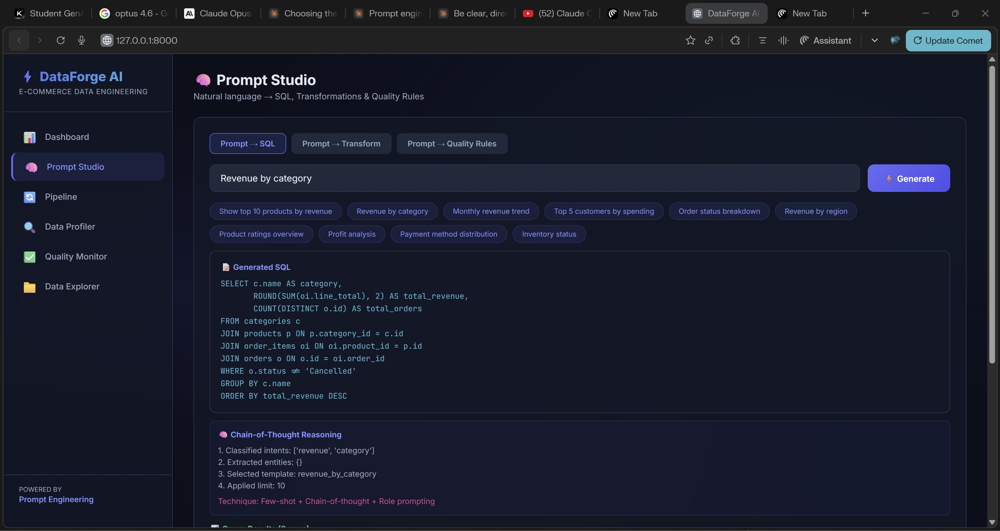
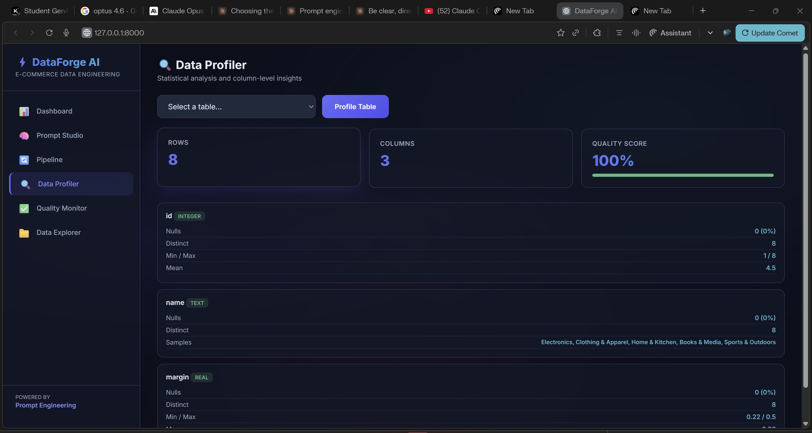

# DataForge AI

**E-Commerce Data Engineering Platform with Prompt Engineering**

An intelligent data engineering platform that transforms natural language prompts into SQL queries, data transformations, and quality rules — all built around a realistic e-commerce dataset.



## Features

### Analytics Dashboard
Real-time KPI cards and interactive charts powered by Chart.js:
- **Total Revenue**, **Orders**, **Customers**, and **Average Order Value**
- Revenue Trend (monthly line chart)
- Revenue by Category (doughnut chart)
- Revenue by Region (bar chart)
- Order Status breakdown

### Prompt Studio
Natural language interface with three prompt modes:



| Mode | Description | Example Prompts |
|------|-------------|-----------------|
| **Prompt to SQL** | Converts plain English to executable SQL | `Show top 10 products by revenue`, `Revenue by category` |
| **Prompt to Transform** | Generates Python transformation code | `Clean null values in dataset`, `RFM customer segmentation` |
| **Prompt to Quality Rules** | Produces data quality validation rules | `Check for missing values and duplicates` |

**Prompt Engineering Techniques Used:**
- Few-shot prompting with curated examples
- Chain-of-thought reasoning traces
- Role prompting (system/user/assistant patterns)
- Intent classification and entity extraction
- Template-based structured output generation

### Data Pipeline
Visual 6-stage ETL pipeline orchestrator:
1. **Ingest** — Load raw data from CSV or database sources
2. **Validate** — Schema compliance and data type checks
3. **Profile** — Statistical profiling and distributions
4. **Transform** — Cleaning, normalization, and enrichment
5. **Quality Check** — Rule-based anomaly detection
6. **Export** — Output processed data to target destination

### Data Profiler
Column-level statistical analysis for any database table:



- Row/column counts and quality scores
- Null counts and percentages
- Distinct value counts
- Min/Max/Mean for numeric columns
- Sample values for text columns

### Quality Monitor
AI-suggested data quality rules across five dimensions:
- **Completeness** — Required field validation
- **Consistency** — Logical relationship checks
- **Validity** — Range and boundary enforcement
- **Uniqueness** — Duplicate detection
- **Timeliness** — Data freshness verification

### Data Explorer
Raw SQL query executor with a table browser for direct database interaction.

## Tech Stack

| Layer | Technology |
|-------|-----------|
| Backend | Python, FastAPI, Uvicorn |
| Database | SQLite (auto-seeded on startup) |
| Frontend | HTML, CSS, JavaScript (single-page app) |
| Charts | Chart.js 4.x |
| Fonts | Inter, JetBrains Mono |

## Database Schema

```
categories    (id, name, margin)
products      (id, name, category_id, price, cost, stock, rating, reviews_count, created_at)
customers     (id, first_name, last_name, email, region, city, signup_date, lifetime_value, order_count)
orders        (id, customer_id, order_date, status, payment_method, subtotal, discount, tax, total, region)
order_items   (id, order_id, product_id, quantity, unit_price, line_total)
datasets      (id, name, source, row_count, column_count, created_at, status)
pipeline_runs (id, pipeline_name, status, started_at, completed_at, records_processed, errors, stage)
```

**Seed Data:** 8 categories, 34 products, 200 customers, 500 orders across 5 global regions.

## Quick Start

### Prerequisites
- Python 3.8+
- pip

### Installation

```bash
pip install -r requirements.txt
```

### Run the Server

```bash
python -m uvicorn main:app --reload --port 8000
```

### Open the App

Navigate to **http://localhost:8000** in your browser.

## API Reference

### Health & Root

| Method | Endpoint | Description |
|--------|----------|-------------|
| `GET` | `/` | Serves the frontend UI |
| `GET` | `/api/health` | Health check |

### Datasets

| Method | Endpoint | Description |
|--------|----------|-------------|
| `GET` | `/api/datasets` | List all datasets |
| `POST` | `/api/datasets/seed` | Re-seed sample data |
| `POST` | `/api/datasets/upload` | Upload a CSV file |

### Data Profiling

| Method | Endpoint | Description |
|--------|----------|-------------|
| `GET` | `/api/datasets/{id}/profile` | Profile all data tables |
| `GET` | `/api/profile/{table_name}` | Profile a specific table |

### Prompt Engineering

| Method | Endpoint | Description |
|--------|----------|-------------|
| `POST` | `/api/prompt/sql` | Natural language to SQL |
| `POST` | `/api/prompt/transform` | Natural language to transformation code |
| `POST` | `/api/prompt/quality` | Natural language to quality rules |
| `POST` | `/api/query/execute` | Execute raw SQL query |

### Pipeline

| Method | Endpoint | Description |
|--------|----------|-------------|
| `GET` | `/api/pipeline/status` | Get pipeline status and history |
| `POST` | `/api/pipeline/run` | Execute a full pipeline run |

### Dashboard

| Method | Endpoint | Description |
|--------|----------|-------------|
| `GET` | `/api/dashboard/kpis` | All dashboard KPIs and chart data |
| `GET` | `/api/tables` | List all tables with row/column counts |

## Example API Calls

```bash
# Health check
curl http://localhost:8000/api/health

# Dashboard KPIs
curl http://localhost:8000/api/dashboard/kpis

# Natural language to SQL
curl -X POST http://localhost:8000/api/prompt/sql \
  -H "Content-Type: application/json" \
  -d '{"prompt": "show top 10 products by revenue"}'

# Run ETL pipeline
curl -X POST http://localhost:8000/api/pipeline/run

# Execute raw SQL
curl -X POST http://localhost:8000/api/query/execute \
  -H "Content-Type: application/json" \
  -d '{"sql": "SELECT * FROM orders LIMIT 5"}'
```

## Project Structure

```
PromptDataEngineering/
├── main.py              # FastAPI application and API routes
├── prompt_engine.py     # Prompt engineering module (templates, intent classification, SQL/transform/quality generation)
├── data_pipeline.py     # Data profiling, pipeline orchestration, and query execution
├── sample_data.py       # E-commerce data seeder (categories, products, customers, orders)
├── requirements.txt     # Python dependencies
├── RUNBOOK.md           # Execution runbook
├── static/
│   └── index.html       # Single-page frontend (dashboard, prompt studio, pipeline, profiler, quality, explorer)
├── bashboard.jpg        # Dashboard screenshot
├── dataprofiler.jpg     # Data profiler screenshot
└── prompt_studio.jpg    # Prompt studio screenshot
```

## Prompt Engineering Patterns

This project demonstrates production-grade prompt engineering without requiring external LLM APIs:

| Pattern | Implementation |
|---------|---------------|
| **Few-Shot Prompting** | 5 curated SQL examples with input/reasoning/output triples |
| **Chain-of-Thought** | Step-by-step reasoning traces for every generated query |
| **Role Prompting** | System prompt defining a senior SQL analyst persona |
| **Intent Classification** | Regex-based classification across 15 intent categories |
| **Entity Extraction** | Structured extraction of numbers, dates, aggregations, sort orders |
| **Template Matching** | 13 SQL templates, 6 transformation templates, 5 quality rule categories |

## Troubleshooting

| Issue | Solution |
|-------|----------|
| Port 8000 in use | Use `--port 8001` flag |
| Module not found | Run `pip install -r requirements.txt` |
| Database issues | Delete `dataforge.db` — it auto-regenerates on startup |

## License

This project is for educational and demonstration purposes.
