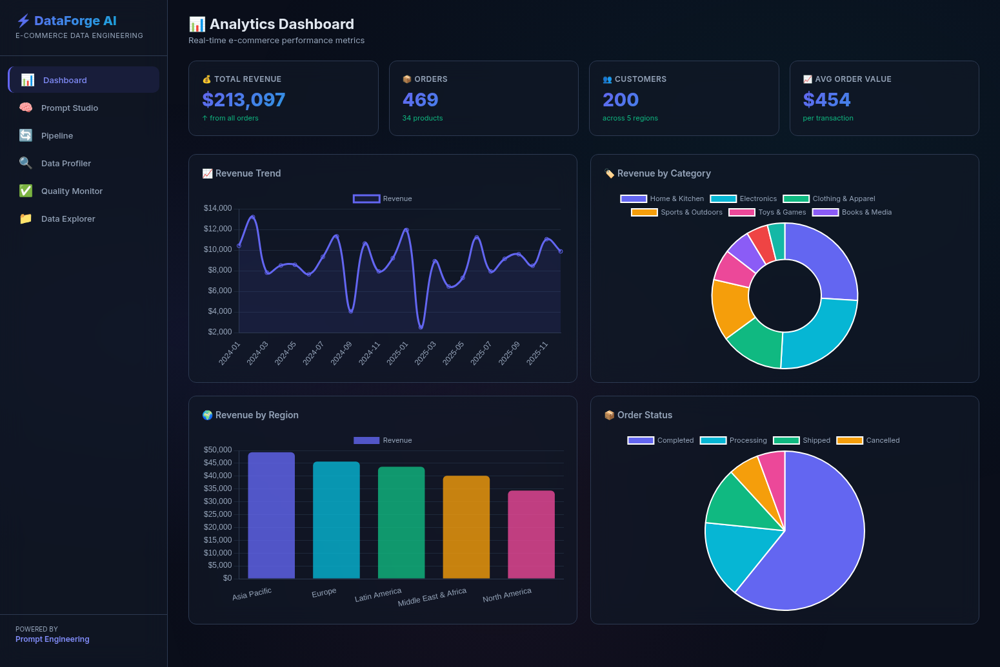
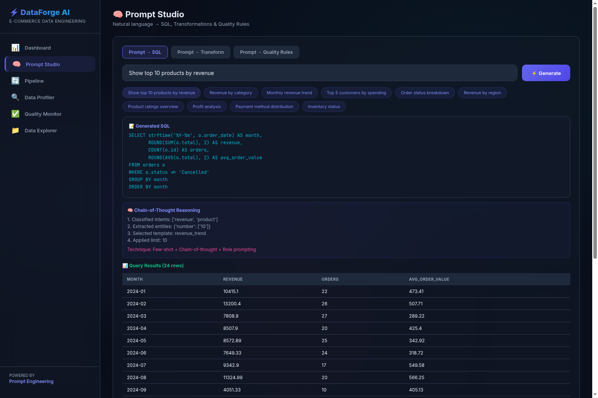
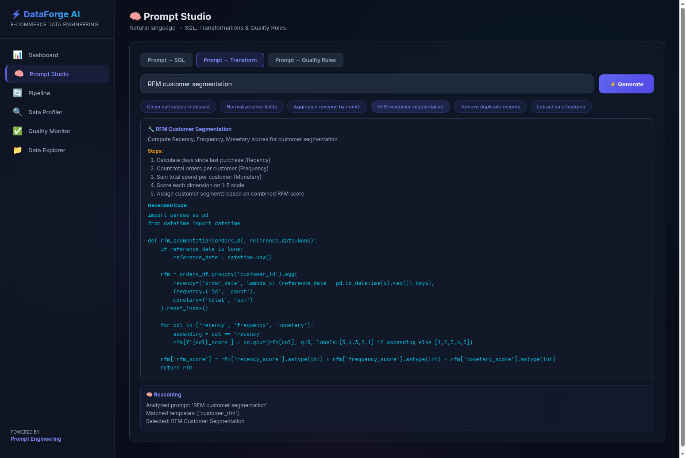
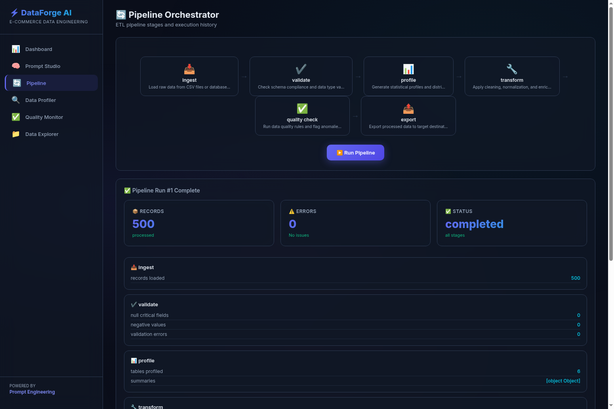
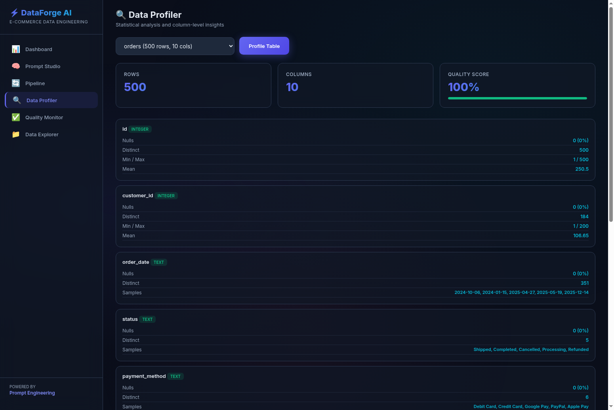
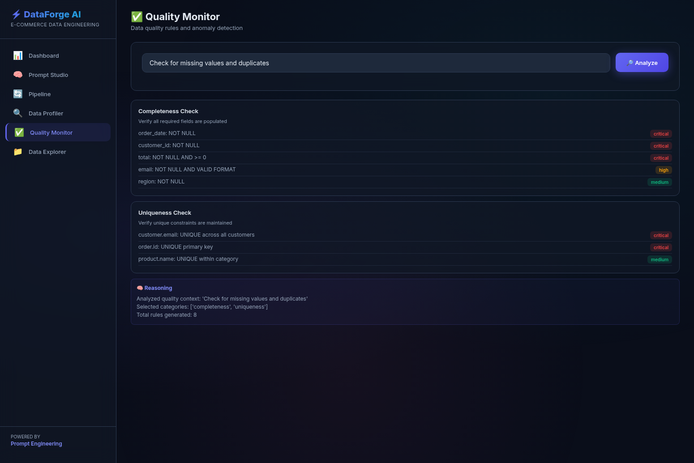
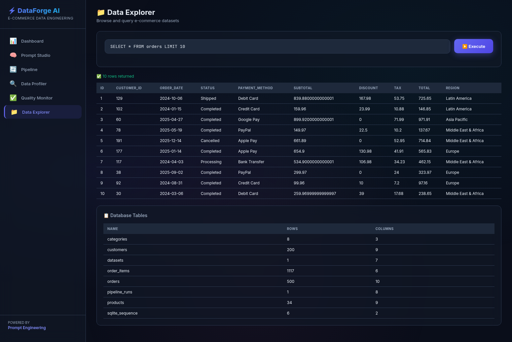

# DataForge AI — Features

A complete list of all features in the DataForge AI platform with descriptions and screenshots.

---

## 1. Analytics Dashboard

Real-time e-commerce performance metrics with interactive visualizations.

| Feature | Description |
|---------|-------------|
| **KPI Cards** | Total Revenue, Total Orders, Total Customers, Average Order Value |
| **Revenue Trend Chart** | Monthly revenue line chart across 2024-2025 |
| **Revenue by Category** | Doughnut chart showing revenue distribution across 8 product categories |
| **Revenue by Region** | Bar chart comparing revenue across 5 global regions |
| **Order Status Chart** | Pie chart showing order status breakdown (Completed, Processing, Shipped, Cancelled, Refunded) |
| **Top Products** | Revenue leaders across all product categories |
| **Payment Methods** | Distribution of payment methods (Credit Card, PayPal, Debit Card, Apple Pay, Google Pay, Bank Transfer) |

---

## 2. Prompt Studio — Prompt to SQL

Convert natural language questions into executable SQL queries with chain-of-thought reasoning.

| Feature | Description |
|---------|-------------|
| **Natural Language Input** | Type questions like "Show top 10 products by revenue" |
| **Intent Classification** | Automatically detects 15 intent categories (revenue, product, customer, trend, etc.) |
| **Entity Extraction** | Extracts numbers, dates, aggregation types, and sort orders from prompts |
| **SQL Generation** | Produces optimized SQL from 13 pre-built templates |
| **Chain-of-Thought Reasoning** | Shows step-by-step reasoning trace for transparency |
| **Live Query Results** | Executes the generated SQL and displays results in a table |
| **Few-Shot Examples** | 5 curated examples guide the template matching |
| **Suggestion Chips** | Quick-access prompt suggestions for common queries |

---

## 3. Prompt Studio — Prompt to Transform

Generate Python data transformation code from plain English descriptions.

| Feature | Description |
|---------|-------------|
| **Transformation Generation** | Converts descriptions to Python code with step-by-step plans |
| **Clean Null Values** | Detect and fill missing values using median/mode strategies |
| **Normalize Prices** | Standardize price fields and detect outliers using IQR |
| **Aggregate Revenue** | Group-by aggregations with running totals and growth rates |
| **RFM Segmentation** | Recency-Frequency-Monetary customer scoring and segmentation |
| **Deduplicate Records** | Identify and remove exact/near duplicate records |
| **Date Feature Engineering** | Extract year, month, day, quarter, weekend flags from dates |

---

## 4. Prompt Studio — Prompt to Quality Rules

Generate data quality validation rules based on natural language quality concerns.

| Feature | Description |
|---------|-------------|
| **Completeness Rules** | Verify required fields (order_date, customer_id, total, email, region) |
| **Consistency Rules** | Check logical relationships (total = subtotal - discount + tax) |
| **Validity Rules** | Enforce value ranges (rating 1-5, quantity > 0, non-negative stock) |
| **Uniqueness Rules** | Detect duplicates (unique emails, primary keys) |
| **Timeliness Rules** | Verify data freshness (date ranges, no future dates) |
| **Severity Badges** | Color-coded severity levels: critical, high, medium, low |
| **Context-Aware Selection** | Only shows relevant rule categories based on the prompt |

---

## 5. Pipeline Orchestrator

Visual 6-stage ETL pipeline with execution tracking and run history.

| Feature | Description |
|---------|-------------|
| **Visual DAG** | 6 pipeline stages displayed as connected nodes |
| **One-Click Execution** | Run the full pipeline with a single button click |
| **Ingest Stage** | Loads raw data and counts records |
| **Validate Stage** | Checks for NULL critical fields and negative values |
| **Profile Stage** | Runs statistical profiling on all data tables |
| **Transform Stage** | Detects price inconsistencies and applies normalization |
| **Quality Check Stage** | Verifies email uniqueness and rating validity |
| **Export Stage** | Records processed data summary to destination |
| **Run Summary** | Shows total records processed, errors, and completion status |
| **Stage Details** | Expandable cards showing per-stage metrics |
| **Run History** | Table of past pipeline runs with timestamps and error counts |

---

## 6. Data Profiler

Column-level statistical analysis with quality scoring for any database table.

| Feature | Description |
|---------|-------------|
| **Table Selector** | Dropdown listing all tables with row/column counts |
| **Summary Cards** | Row count, column count, and overall quality score (0-100%) |
| **Column Profiles** | Per-column cards showing type, nulls, and distinct values |
| **Numeric Statistics** | Min, Max, Mean for numeric columns (INTEGER, REAL) |
| **Text Samples** | Up to 5 sample values for TEXT columns |
| **Null Analysis** | Null count and percentage per column |
| **Quality Score Bar** | Visual progress bar showing data completeness |
| **Type Badges** | Color-coded badges for column data types (INTEGER, TEXT, REAL) |

---

## 7. Quality Monitor

Dedicated quality analysis page for targeted data quality assessments.

| Feature | Description |
|---------|-------------|
| **Natural Language Input** | Describe quality concerns in plain English |
| **Targeted Analysis** | Only surfaces relevant quality categories |
| **18 Total Rules** | Across 5 quality dimensions (completeness, consistency, validity, uniqueness, timeliness) |
| **Severity Classification** | Each rule tagged as critical, high, medium, or low |
| **Reasoning Trace** | Shows which categories were selected and why |
| **Rule Descriptions** | Human-readable explanation of each quality check |

---

## 8. Data Explorer

Interactive SQL query executor with a database table browser.

| Feature | Description |
|---------|-------------|
| **SQL Input** | Monospaced input field for writing SQL queries |
| **Execute Button** | Runs the query and displays results instantly |
| **Results Table** | Rendered data table with column headers and row data |
| **Row Count Badge** | Shows the number of rows returned |
| **Table Browser** | Lists all database tables with row and column counts |
| **Read-Only Safety** | Only SELECT queries are permitted (no writes/deletes) |
| **Result Limit** | Caps results at 100 rows to prevent overload |

---

## Architecture Overview

| Component | Technology | File |
|-----------|-----------|------|
| **Web Server** | FastAPI + Uvicorn | `main.py` |
| **Prompt Engine** | Template-based NLP (no external LLM) | `prompt_engine.py` |
| **Data Pipeline** | Profiler + Orchestrator + Query Executor | `data_pipeline.py` |
| **Data Seeder** | Realistic e-commerce generator | `sample_data.py` |
| **Frontend** | HTML + CSS + JavaScript + Chart.js | `static/index.html` |
| **Database** | SQLite (auto-seeded) | `dataforge.db` |

---

## Dataset Summary

| Table | Rows | Description |
|-------|------|-------------|
| categories | 8 | Product categories with margins |
| products | 34 | Products with prices, costs, stock, ratings |
| customers | 200 | Customers across 5 global regions |
| orders | 500 | Orders with payment methods and statuses |
| order_items | 1,117 | Individual line items per order |
| datasets | 1 | Dataset metadata |
| pipeline_runs | varies | ETL pipeline execution history |
